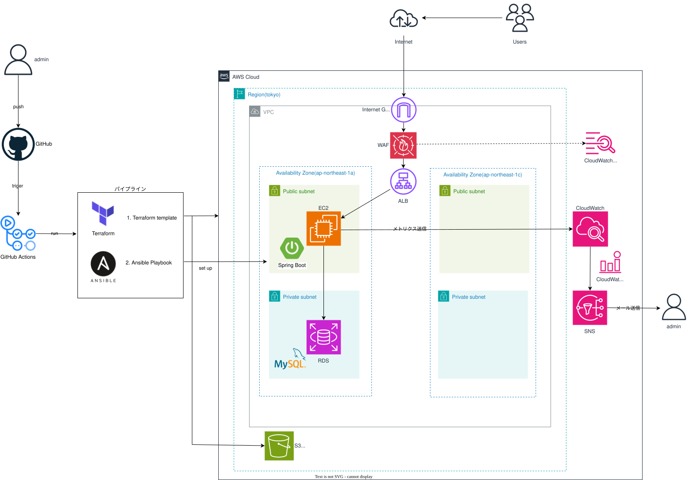
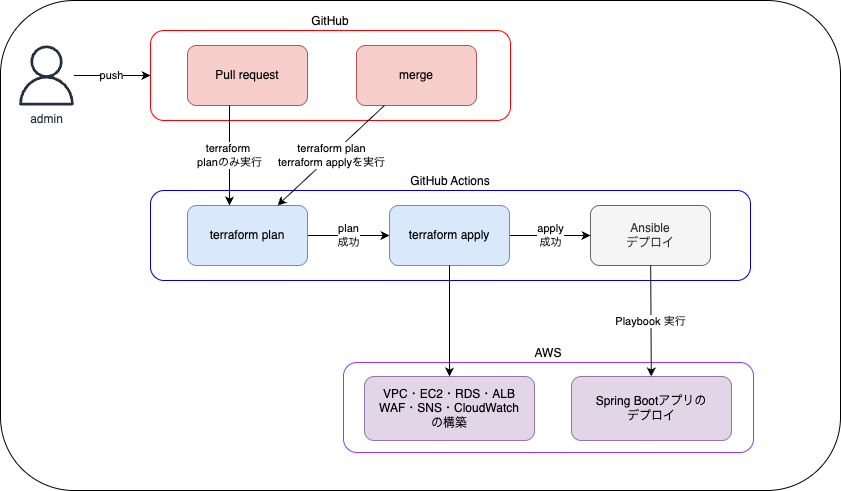

## 1. プロジェクト概要
### 受講生情報表示アプリ 自動デプロイパイプライン
GitHubへのpushをトリガーに、インフラ構築からアプリのデプロイまでを完全自動化したCI/CDパイプラインです。

Terraform・GitHub Actions・Ansibleを組み合わせ、再現性の高い環境構築を実現しています。

## 2. システム構成
### 2.1 構成図


### 2.2 VPC/ネットワーク構成
| リソース | CIDR | AZ | 役割 |
|:---:|:---:|:---:|---|
| VPC | 10.0.0.0/16 | - | 全リソースを収容 |
| PublicSubnet1 | 10.0.1.0/24 | ap-northeast-1a | EC2配置・ALB |
| PublicSubnet2 | 10.0.3.0/24 | ap-northeast-1c | AL冗長化用 |
| PrivateSubnet1 | 10.0.2.0/24 | ap-northeast-1a | RDS配置 |
| PrivateSubnet2 | 10.0.4.0/24 | ap-northeast-1c | RDSサブネットグループ用 |

## 3. CI/CDパイプラインフロー


pushから自動デプロイ完了まで完全自動化をしており、人の操作は不要です。

## 4. 使用技術
| カテゴリ | 技術 | バージョン |
|:---:|:---:|:---:|
| CI/CD | GitHub Actions | - |
| IaC | Terraform | 1.14.8 |
| デプロイ | Ansible |  |
| アプリケーション | Spring Boot |  |
| クラウド | AWS | - |
| OS | Amazon Linux 2023 | - |
| データベース | MySQL | 8.0.43 |

## 5. AWSリソース一覧
| リソース | サービス | 用途 |
|:---:|:---:|---|
| VPC | Amazon VPC | ネットワーク全体の分離 |
| EC2 | t3.micro | アプリケーションサーバー |
| RDS | db.t4g.micro | データベース |
| ALB | Application Load Balancer | HTTPリクエストのルーティング |
| WAFv2 | AWS WAF | ALBへの不正アクセスをブロック |
| CloudWatch | Alarm | CPU使用率の監視・アラート |
| SNS | Topic/Subscription | メール通知 |
| CloudWatch Logs | Log Group | WAFログの収集・保管 |

## 6. ディレクトリ構成
```text
.
├── .github
│   └── workflows
│       ├── ansible.yml                   # GitHub Actionsワークフロー定義(Ansible実行)
│       └── terraform-cicd.yml            # GitHub Actionsワークフロー定義(Terraform実行)
├── .gitignore                            # gitにpushしないファイルを定義
├── ansible
│   ├── ansible.cfg                       # 動作設定
│   ├── inventory
│   │   └── group_vars
│   │       └── all.yml                   # 接続・環境設定
│   ├── playbooks
│   │   └── playbook.yml                  # デプロイ手順の定義
│   └── templates
│       ├── application.properties.j2     # アプリケーション設定ファイル
│       └── springapp.service.j2          # Systemd用のテンプレート
├── main.tf                               # リソース定義
├── outputs.tf                            # アウトプット定義(EC2のIDなど)
├── terraform.tf                          # Terraform本体の設定
├── terraform.tfvars                      # 変数の値
├── test.tftest.hcl                       # テストコード
└── variables.tf                          # 変数定義
```

## 7. デプロイ手順
### 7.1 前提条件
- AWSアカウントおよびIAMユーザー(必要な権限を付与済みであること)
- ap-northeast-1リージョンにEC2キーペアが作成済み
- SNSサブスクリプションを受け取れるメールアドレス
- GitHubリポジトリへのアクセス

### 7.2 GitHub Secretsの設定
リポジトリのSettings → Secrets and variables → Actionsに以下を登録します。

| Secret名 | 内容 |
|:---:|---|
| AWS_ACCESS_KEY_ID | IAMユーザーのアクセスキー |
| EC2 | t3.micro |
| RDS | db.t4g.micro |
| ALB | Application Load Balancer |
| WAFv2 | AWS WAF |
| CloudWatch | Alarm |
| SNS | Topic/Subscription |
| CloudWatch Logs | Log Group |

### 7.3 デブロイの実行
mainブランチにpushするだけで、GitHub Actionsが自動的にデプロイを実行します。

```zsh
git add .
git commit -m ""
git push origin ブランチ名
```

### 7.4 環境の削除
AWSリソースは使用後に削除してください。

削除しないと料金が発生し続けます。

```zsh
terraform destroy
```


